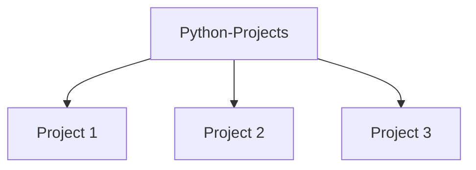

# Python Projects

Welcome to the **Python Projects** repository!  
This repository is a collection of various Python mini-projects, scripts, and experiments, built for learning, experimenting, and showcasing Python programming skills.

---

## 🗺️ Repository Structure Visualization

Below is a visualization of the overall structure of this repository. Each node represents a major project or folder in the repo.  
You can update this diagram as you add or change projects.



*Replace "Project 1", "Project 2", etc., with your actual project/folder names!*

---

## 📁 Projects

### Project 1
- **Description**: Briefly describe what this project does.
- **Technologies**: Python, [any libraries]
- **How to Run**: Instructions to run the project.

### Project 2
- **Description**: Briefly describe what this project does.
- **Technologies**: Python, [any libraries]
- **How to Run**: Instructions to run the project.

### Project 3
- **Description**: Briefly describe what this project does.
- **Technologies**: Python, [any libraries]
- **How to Run**: Instructions to run the project.

*...add more project sections as needed...*

---

## 🛠️ How to Use

1. Clone the repository:
   ```bash
   git clone https://github.com/ajinesh703/Python-Projects.git
   ```
2. Navigate to the desired project directory and follow the usage instructions in its README or section above.

---

## 🤝 Contributing

Contributions are welcome!  
Feel free to fork this repo, submit pull requests, or open issues with suggestions.

---

## 📄 License

This repository is open source and available under the [MIT License](LICENSE).

---

## 📬 Contact

For any questions, connect with [ajinesh703 on GitHub](https://github.com/ajinesh703).# Python-Projects
